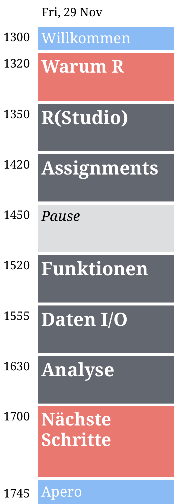

layout: true

<div class="my-footer">
  <span style="text-align:center">
    <span> 
      
    </span>
    <a href="https://therbootcamp.github.io/">
      <span style="padding-left:82px"> 
        <font color="#7E7E7E">
          www.therbootcamp.com
        </font>
      </span>
    </a>
    <a href="https://therbootcamp.github.io/">
      <font color="#7E7E7E">
      Einführung in die moderne Datenanalyse mit R | Februar 2020
      </font>
    </a>
    </span>
  </div> 

---


```{r setup, include=FALSE}
options(htmltools.dir.version = FALSE)
options(width=110)
options(digits = 4)

knitr::opts_chunk$set(fig.align = 'center')
```


.pull-left45[
<br><br><br><br><br>
# Materialien

Klicke auf <high>"....running..."</high> auf unserer Website!

<font style="font-size:28px"><a href="www.therbootcamp.com"><b>www.therbootcamp.com</b></a></font>

]

.pull-right5[

<br><br>
<iframe src="https://therbootcamp.github.io" width="500" height="500"></iframe>

]

---


.pull-left6[

<br><br><br><br><br>


# Ziel


>###Das Ziel dieses Kurses ist es Euch die Grundlagen der Programmiersprache R und einen Überblick über Einsatzmäglichkeiten zu bieten. 

]

.pull-right4[

<br><br><br><br>
<p align="center"></p>

]

---

.pull-left4[

<br>
# Schedule 

<ul>
  <li class="m1"><span>Der Workshop beinhaltet fünf <high>halbstündige R Blöcke</high> (in grau).</span></li>
  <li class="m2"><span>Jeder Block beginnt mit einer kurzen Folien-basierten <high>Einführung (10-15min)</high> und schliesst mit einer interaktiven <high>Übung (15-20min)</high> ab.</span></li>
</ul>


]

.pull-right45[
<br><br>


]

´

---

# Vorstellungsrunde

.pull-left5[

<ul>
  <li class="m1"><span>Wie heisst du?</span></li>
  <li class="m2"><span>Was ist dein Beruf?</span></li>
  <li class="m3"><span>Hast du Programmiererfahrung mit R oder allgemein?</span></li>
  <li class="m4"><span>Wieso möchtest du R lernen?</span></li>
  <li class="m5"><span>Kaffee oder Tee?</span></li>
  <li class="m6"><span>Bier oder Wein?</span></li>
  <li class="m7"><span>Berlin oder Paris?</span></li>
</ul>


]

.pull-right45[

<p align="center">

<br>
<font style="font-size:10px">from <a href="www.artofmanliness.com">artofmanliness.com</a></font>
</p>

]

---
class: middle, center

<h1><a href=https://therbootcamp.github.io/I2R_2019Nov/index.html>Schedule</a></h1>


